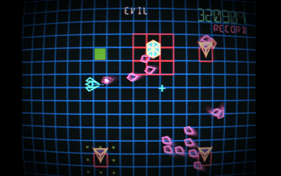

# Evil Glitch Extension

---

Strange glitches appear in your dimension, can you stop them from assimilating your world?

The game is a 2D arcade shoot-'em-up, with retro aesthetics inspired by 80's media; lore and enemies are inspired by the crazy sacred geometry stuff.



```
1. Clone the repository
2. Run `npm install` to install node dependencies
3. Run `npm run build` to build the extension
4. Copy the `dist` folder into EXT
